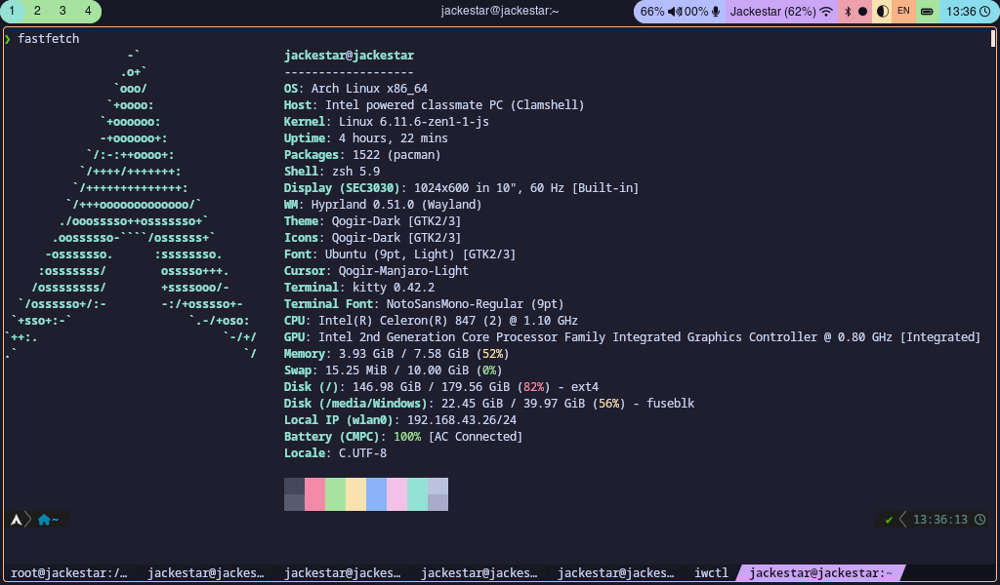

# dotfiles?

## Goal

Template to automate my workflow in Arch Linux. This repository will be split into two in the future, one functioning more as a custom archinstall and the other more as a personal system. The first will focus on copying basic configuration files to provide a UI/UX experience similar to my workflow. The second is more specific with installations and configurations related to my workflow oriented to target machines (a desktop PC, a server, the connections between them, NAS, custom hardware, homelab stuff, home assistant) possibly managed with Ansible or similar, more oriented to those who have a homelab and are looking for an **example** of installation automation.

## Actual dotfiles

Archlinux config files for the installation, and quick configuration.

### UI

wayland, sddm, hyprland, waybar, hyprpaper, rofi, papirus & gtk themed for catppuccin

#### sddm

based in sddm-astronaut-theme

with wallpaper that changes with the time with the catppuccin color scheme

**terminal:** zsh, kitty

## branch/project structure

The repository is currently under development. Once a stable (functional) version is released, the code will be refactored (better UX, more optimized commands). The repository will then take on a structure similar to Git Flow.

# TODO

Auto Partition
Waybar Energy saving mode
Select between rustup and rustc
better readme
set username
select shell
no swap option
ncourses
ansible
more precise hardware detection
node thing (bun,pnpn...)